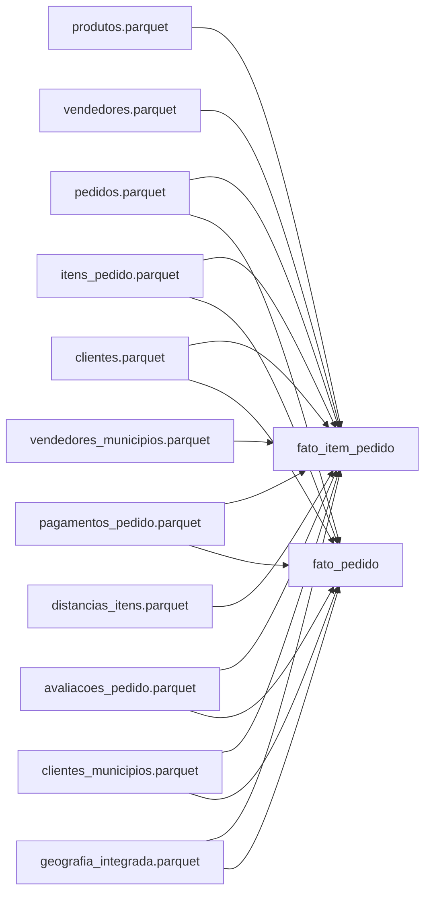

# Contrato de entrada da camada Gold

## 1. Objetivo

Este documento define os arquivos que a camada Gold espera receber da camada Silver e da etapa de integração municipal.

O contrato estabelece:

- Caminho de cada arquivo.
- Grão da tabela.
- Chave única.
- Colunas obrigatórias.
- Tipos esperados no DuckDB.
- Regras de nulidade.
- Responsável pela produção.
- Validações que devem passar antes da carga Gold.

A Gold não corrigirá problemas de granularidade, duplicidade, tipagem ou integração. Caso uma entrada viole este contrato, a carga deverá falhar com uma mensagem clara.

## 2. Convenções gerais

### 2.1 Formato

Todas as entradas serão armazenadas em Parquet dentro de:

```text
data/silver/
```

### 2.2 Nomes

Os nomes de tabelas e atributos derivados serão escritos em português.

Os identificadores originais do Olist serão preservados com os nomes da fonte para facilitar rastreabilidade:

```text
order_id
order_item_id
product_id
customer_id
customer_unique_id
seller_id
```

### 2.3 Tipos

Tipos esperados:

| Conteúdo | Tipo DuckDB |
| --- | --- |
| Identificadores | `VARCHAR` |
| Código IBGE | `VARCHAR` |
| Prefixo de CEP | `VARCHAR` |
| Datas sem horário | `DATE` |
| Datas com horário | `TIMESTAMP` |
| Valores monetários | `DECIMAL(18,2)` |
| Coordenadas e distâncias | `DOUBLE` |
| Contagens | `INTEGER` ou `BIGINT` |
| Indicadores lógicos | `BOOLEAN` |

O código IBGE e o prefixo de CEP serão textos para preservar zeros à esquerda.

### 2.4 Nulos

Valores ausentes continuarão nulos, salvo quando houver uma regra de negócio explicitamente aprovada.

Não será permitido:

- Substituir indicador socioeconômico ausente por zero.
- Substituir nota ausente por zero.
- Classificar pedido não entregue como não atrasado.
- Inventar código de município.
- Eliminar registros apenas porque possuem campos nulos.

### 2.5 Linhagem

As colunas de linhagem da Bronze não precisam ser copiadas para todas as tabelas Silver.

A rastreabilidade será mantida pelas chaves naturais da fonte, como `order_id`, `product_id`, `customer_id` e `seller_id`.

## 3. Resumo das entradas

| Arquivo | Grão | Chave única | Produzido por |
| --- | --- | --- | --- |
| `produtos.parquet` | Um produto | `product_id` | Transformação Silver |
| `clientes.parquet` | Um cadastro de cliente por pedido | `customer_id` | Transformação Silver |
| `vendedores.parquet` | Um vendedor | `seller_id` | Transformação Silver |
| `pedidos.parquet` | Um pedido | `order_id` | Transformação Silver |
| `itens_pedido.parquet` | Um item do pedido | `order_id + order_item_id` | Transformação Silver |
| `pagamentos_pedido.parquet` | Um resumo de pagamento por pedido | `order_id` | Transformação Silver |
| `avaliacoes_pedido.parquet` | Uma avaliação selecionada por pedido | `order_id` | Transformação Silver |
| `geografia_integrada.parquet` | Um município IBGE | `cod_ibge` | Integração municipal |
| `clientes_municipios.parquet` | Um cadastro de cliente | `customer_id` | Integração municipal |
| `vendedores_municipios.parquet` | Um vendedor | `seller_id` | Integração municipal |
| `distancias_itens.parquet` | Um item de pedido | `order_id + order_item_id` | Integração municipal |

## 4. Produtos

### 4.1 Arquivo

```text
data/silver/produtos.parquet
```

### 4.2 Grão

Uma linha para cada `product_id`.

### 4.3 Estrutura

| Coluna | Tipo | Aceita nulo | Regra |
| --- | --- | --- | --- |
| `product_id` | VARCHAR | Não | Identificador natural do produto |
| `categoria_pt` | VARCHAR | Não | Usar `nao_informado` quando ausente |
| `categoria_en` | VARCHAR | Sim | Tradução da categoria |
| `peso_gramas` | DECIMAL(18,2) | Sim | Original ou mediana da categoria |
| `comprimento_cm` | DECIMAL(18,2) | Sim | Original ou mediana da categoria |
| `altura_cm` | DECIMAL(18,2) | Sim | Original ou mediana da categoria |
| `largura_cm` | DECIMAL(18,2) | Sim | Original ou mediana da categoria |
| `volume_cm3` | DECIMAL(18,2) | Sim | Comprimento × altura × largura |
| `faixa_peso` | VARCHAR | Sim | Classificação aprovada pelo grupo |
| `peso_imputado` | BOOLEAN | Não | Verdadeiro quando houver imputação |
| `dimensoes_imputadas` | BOOLEAN | Não | Verdadeiro quando alguma dimensão for imputada |

### 4.4 Regras

- `product_id` deve ser único.
- Produtos sem categoria não podem ser descartados.
- Se a categoria não tiver dados suficientes para imputação, a medida permanece nula.
- `volume_cm3` será nulo quando alguma dimensão necessária estiver ausente.

## 5. Clientes

### 5.1 Arquivo

```text
data/silver/clientes.parquet
```

### 5.2 Grão

Uma linha para cada `customer_id`.

Esse arquivo ainda representa o cadastro associado ao pedido. A Gold utilizará `customer_unique_id` como chave natural da dimensão cliente.

### 5.3 Estrutura

| Coluna | Tipo | Aceita nulo | Regra |
| --- | --- | --- | --- |
| `customer_id` | VARCHAR | Não | Identificador do cliente no pedido |
| `customer_unique_id` | VARCHAR | Não | Identificador persistente da pessoa |
| `prefixo_cep_cliente` | VARCHAR | Sim | Texto com cinco dígitos |
| `cidade_cliente_original` | VARCHAR | Sim | Valor original do Olist |
| `cidade_cliente_normalizada` | VARCHAR | Sim | Valor normalizado |
| `uf_cliente` | VARCHAR | Sim | Sigla da UF em maiúsculas |

### 5.4 Regras

- `customer_id` deve ser único.
- `customer_unique_id` pode aparecer em várias linhas.
- Um cliente único pode realizar pedidos em endereços diferentes.
- A Gold não escolherá um único município para representar toda a vida do cliente.

## 6. Vendedores

### 6.1 Arquivo

```text
data/silver/vendedores.parquet
```

### 6.2 Grão

Uma linha para cada `seller_id`.

### 6.3 Estrutura

| Coluna | Tipo | Aceita nulo | Regra |
| --- | --- | --- | --- |
| `seller_id` | VARCHAR | Não | Identificador natural do vendedor |
| `prefixo_cep_vendedor` | VARCHAR | Sim | Texto com cinco dígitos |
| `cidade_vendedor_original` | VARCHAR | Sim | Valor original do Olist |
| `cidade_vendedor_normalizada` | VARCHAR | Sim | Valor normalizado |
| `uf_vendedor` | VARCHAR | Sim | Sigla da UF em maiúsculas |

### 6.4 Regras

- `seller_id` deve ser único.
- Valores originais e normalizados devem ser mantidos separadamente.

## 7. Pedidos

### 7.1 Arquivo

```text
data/silver/pedidos.parquet
```

### 7.2 Grão

Uma linha para cada `order_id`.

### 7.3 Estrutura

| Coluna | Tipo | Aceita nulo | Regra |
| --- | --- | --- | --- |
| `order_id` | VARCHAR | Não | Identificador do pedido |
| `customer_id` | VARCHAR | Não | Liga o pedido ao cadastro do cliente |
| `status_pedido` | VARCHAR | Não | Status original padronizado |
| `data_compra` | TIMESTAMP | Sim | Data e hora da compra |
| `data_aprovacao` | TIMESTAMP | Sim | Data e hora da aprovação |
| `data_envio_transportadora` | TIMESTAMP | Sim | Data de postagem |
| `data_entrega_cliente` | TIMESTAMP | Sim | Data real da entrega |
| `data_estimada_entrega` | TIMESTAMP | Sim | Data estimada |
| `flag_entregue` | BOOLEAN | Não | Verdadeiro para pedido entregue |
| `dias_ate_entrega` | INTEGER | Sim | Diferença entre compra e entrega |
| `dias_atraso` | INTEGER | Sim | Entrega real menos entrega estimada |
| `flag_atraso` | BOOLEAN | Sim | Verdadeiro quando `dias_atraso > 0` |
| `ano_mes` | VARCHAR | Sim | Compra no formato `AAAA-MM` |

### 7.4 Regras

- `order_id` deve ser único.
- Pedidos sem itens devem permanecer neste arquivo.
- Para pedidos não entregues, `dias_ate_entrega`, `dias_atraso` e `flag_atraso` devem ser nulos.
- Métricas de prazo somente serão válidas para pedidos entregues e com datas suficientes.
- Valores negativos de `dias_atraso` são válidos e representam entrega antecipada.

## 8. Itens de pedido

### 8.1 Arquivo

```text
data/silver/itens_pedido.parquet
```

### 8.2 Grão

Uma linha para cada combinação:

```text
order_id + order_item_id
```

### 8.3 Estrutura

| Coluna | Tipo | Aceita nulo | Regra |
| --- | --- | --- | --- |
| `order_id` | VARCHAR | Não | Identificador do pedido |
| `order_item_id` | INTEGER | Não | Número do item dentro do pedido |
| `product_id` | VARCHAR | Sim | Produto vendido |
| `seller_id` | VARCHAR | Sim | Vendedor do item |
| `data_limite_envio` | TIMESTAMP | Sim | Limite de envio |
| `valor_produto` | DECIMAL(18,2) | Sim | Preço original do item |
| `valor_frete` | DECIMAL(18,2) | Sim | Frete original do item |
| `valor_total_item` | DECIMAL(18,2) | Sim | Produto mais frete |
| `faixa_preco` | VARCHAR | Sim | Classificação do preço |
| `flag_outlier_frete` | BOOLEAN | Não | Indica outlier sem alterar o valor |
| `valor_frete_winsorizado` | DECIMAL(18,2) | Sim | Somente se a winsorização for ativada |

### 8.4 Regras

- A chave `order_id + order_item_id` deve ser única.
- Nenhum join com pagamento ou avaliação poderá multiplicar as linhas.
- `valor_total_item` deverá ser igual a `valor_produto + valor_frete`.
- O valor original do frete será sempre preservado.
- A winsorização não será aplicada por padrão.
- A Gold utilizará o frete original para reconciliação.

## 9. Pagamentos consolidados

### 9.1 Arquivo

```text
data/silver/pagamentos_pedido.parquet
```

### 9.2 Grão

Uma linha para cada `order_id`.

### 9.3 Estrutura

| Coluna | Tipo | Aceita nulo | Regra |
| --- | --- | --- | --- |
| `order_id` | VARCHAR | Não | Identificador do pedido |
| `tipo_pagamento_predominante` | VARCHAR | Sim | Tipo com maior valor agregado |
| `quantidade_parcelas` | INTEGER | Sim | Parcelas do tipo predominante |
| `faixa_parcelas` | VARCHAR | Sim | Classificação das parcelas |
| `quantidade_transacoes_pagamento` | INTEGER | Não | Número de registros originais |
| `quantidade_tipos_pagamento` | INTEGER | Não | Tipos distintos no pedido |
| `valor_pagamento_total` | DECIMAL(18,2) | Sim | Soma dos pagamentos para auditoria |

### 9.4 Regras

- `order_id` deve ser único.
- O valor total de pagamento será mantido para auditoria.
- `valor_pagamento_total` não será levado à `fato_item_pedido`.
- O tipo predominante será definido pelo maior valor agregado por tipo.
- Empates deverão usar uma ordem determinística.
- `quantidade_parcelas` será o maior número de parcelas do tipo predominante.

## 10. Avaliações consolidadas

### 10.1 Arquivo

```text
data/silver/avaliacoes_pedido.parquet
```

### 10.2 Grão

No máximo uma linha para cada `order_id`.

Pedidos sem avaliação podem não aparecer neste arquivo.

### 10.3 Estrutura

| Coluna | Tipo | Aceita nulo | Regra |
| --- | --- | --- | --- |
| `order_id` | VARCHAR | Não | Identificador do pedido |
| `review_id` | VARCHAR | Não | Avaliação selecionada |
| `nota_avaliacao` | INTEGER | Sim | Nota do pedido |
| `data_criacao_avaliacao` | TIMESTAMP | Sim | Data utilizada para selecionar a mais recente |
| `data_resposta_avaliacao` | TIMESTAMP | Sim | Data da resposta |
| `quantidade_avaliacoes` | INTEGER | Não | Avaliações encontradas para o pedido |

### 10.4 Regras

- `order_id` deve ser único.
- Quando houver várias avaliações, selecionar a mais recente por `data_criacao_avaliacao`.
- Empates devem ser resolvidos deterministicamente, por exemplo por `review_id`.
- Nota ausente continuará nula.
- Quando presente, a nota deverá estar entre 1 e 5.

## 11. Geografia integrada

### 11.1 Arquivo

```text
data/silver/geografia_integrada.parquet
```

### 11.2 Grão

Uma linha para cada município do cadastro canônico do IBGE.

### 11.3 Estrutura

| Coluna | Tipo | Aceita nulo | Regra |
| --- | --- | --- | --- |
| `cod_ibge` | VARCHAR | Não | Código municipal com sete dígitos |
| `municipio` | VARCHAR | Não | Nome oficial do município |
| `municipio_normalizado` | VARCHAR | Não | Nome usado no match |
| `uf` | VARCHAR | Não | Sigla da UF |
| `nome_uf` | VARCHAR | Sim | Nome da UF |
| `regiao` | VARCHAR | Sim | Região brasileira |
| `populacao_estimada` | BIGINT | Sim | População em 2017 |
| `pib_per_capita` | DECIMAL(18,2) | Sim | PIB per capita em 2017 |
| `ano_referencia_indicadores` | INTEGER | Sim | Esperado: 2017 |
| `porte_municipio` | VARCHAR | Não | Faixa populacional ou `nao_informado` |
| `latitude_representativa` | DOUBLE | Sim | Mediana derivada dos matches exatos do Olist |
| `longitude_representativa` | DOUBLE | Sim | Mediana derivada dos matches exatos do Olist |

### 11.4 Regras

- `cod_ibge` deve ser único.
- A tabela deve preservar todos os municípios retornados pelo cadastro IBGE.
- Indicadores socioeconômicos ausentes permanecem nulos.
- Coordenadas ausentes permanecem nulas.
- As coordenadas são aproximações derivadas do Olist, não centroides oficiais.
- Somente matches exatos podem formar o ponto representativo municipal.

## 12. Mapeamento dos clientes para municípios

### 12.1 Arquivo

```text
data/silver/clientes_municipios.parquet
```

### 12.2 Grão

Uma linha para cada `customer_id`.

### 12.3 Estrutura

| Coluna | Tipo | Aceita nulo | Regra |
| --- | --- | --- | --- |
| `customer_id` | VARCHAR | Não | Identificador do cadastro do cliente |
| `cod_ibge` | VARCHAR | Sim | Município encontrado |
| `metodo_match` | VARCHAR | Não | Método utilizado |
| `distancia_match_km` | DOUBLE | Sim | Distância do fallback geográfico |
| `latitude_cliente` | DOUBLE | Sim | Mediana do prefixo de CEP |
| `longitude_cliente` | DOUBLE | Sim | Mediana do prefixo de CEP |
| `cidade_original` | VARCHAR | Sim | Cidade recebida do Olist |
| `cidade_normalizada` | VARCHAR | Sim | Cidade após normalização |
| `uf` | VARCHAR | Sim | UF do cliente |
| `motivo_nao_resolvido` | VARCHAR | Sim | Explicação quando não houver match |

### 12.4 Valores de `metodo_match`

```text
exato
geografico
manual
nao_resolvido
```

### 12.5 Regras

- `customer_id` deve ser único.
- Match por nome sempre deve considerar cidade normalizada e UF.
- O fallback geográfico deverá buscar candidatos somente na mesma UF.
- Casos ambíguos ou acima do limite de distância ficarão não resolvidos.
- Para `nao_resolvido`, `cod_ibge` será nulo.
- A Gold mapeará `cod_ibge` nulo para `sk_geografia = 0`.

## 13. Mapeamento dos vendedores para municípios

### 13.1 Arquivo

```text
data/silver/vendedores_municipios.parquet
```

### 13.2 Grão

Uma linha para cada `seller_id`.

### 13.3 Estrutura

| Coluna | Tipo | Aceita nulo | Regra |
| --- | --- | --- | --- |
| `seller_id` | VARCHAR | Não | Identificador do vendedor |
| `cod_ibge` | VARCHAR | Sim | Município encontrado |
| `metodo_match` | VARCHAR | Não | Método utilizado |
| `distancia_match_km` | DOUBLE | Sim | Distância usada no fallback |
| `latitude_vendedor` | DOUBLE | Sim | Mediana do prefixo de CEP |
| `longitude_vendedor` | DOUBLE | Sim | Mediana do prefixo de CEP |
| `cidade_original` | VARCHAR | Sim | Cidade recebida do Olist |
| `cidade_normalizada` | VARCHAR | Sim | Cidade após normalização |
| `uf` | VARCHAR | Sim | UF do vendedor |
| `motivo_nao_resolvido` | VARCHAR | Sim | Explicação da ausência de match |

### 13.4 Regras

Aplicam-se as mesmas regras de integração utilizadas para clientes.

A chave `seller_id` deve ser única.

## 14. Distâncias dos itens

### 14.1 Arquivo

```text
data/silver/distancias_itens.parquet
```

### 14.2 Grão

Uma linha para cada:

```text
order_id + order_item_id
```

### 14.3 Estrutura

| Coluna | Tipo | Aceita nulo | Regra |
| --- | --- | --- | --- |
| `order_id` | VARCHAR | Não | Identificador do pedido |
| `order_item_id` | INTEGER | Não | Identificador do item |
| `distancia_km` | DOUBLE | Sim | Distância Haversine vendedor–cliente |
| `flag_distancia_calculada` | BOOLEAN | Não | Indica cálculo bem-sucedido |
| `motivo_distancia_ausente` | VARCHAR | Sim | Motivo da distância nula |

### 14.4 Regras

- A chave `order_id + order_item_id` deve ser única.
- A distância será calculada entre as medianas dos prefixos de CEP do cliente e do vendedor.
- Não usar latitude ou longitude igual a zero como coordenada válida sem verificação.
- Se uma das coordenadas estiver ausente ou inválida, `distancia_km` permanecerá nula.
- A distância representa linha geodésica aproximada, não percurso rodoviário.
- Valores suspeitos não serão apagados silenciosamente.

## 15. Relatórios da integração

Além dos Parquets, a integração municipal deverá produzir:

```text
data/silver/municipios_nao_resolvidos.csv
data/silver/qualidade_integracao_municipios.json
```

O relatório JSON deverá conter, no mínimo:

```json
{
  "total_clientes": 0,
  "clientes_match_exato": 0,
  "clientes_match_geografico": 0,
  "clientes_match_manual": 0,
  "clientes_nao_resolvidos": 0,
  "taxa_match_clientes": 0.0,
  "total_vendedores": 0,
  "vendedores_match_exato": 0,
  "vendedores_match_geografico": 0,
  "vendedores_match_manual": 0,
  "vendedores_nao_resolvidos": 0,
  "taxa_match_vendedores": 0.0
}
```

Os zeros acima representam apenas a estrutura do documento, não resultados esperados. O arquivo real será produzido com os dados processados.

## 16. Dependências entre as entradas



## 17. Validações antes da carga Gold

Antes de criar as dimensões e fatos, `dimensional.py` deverá validar:

### 17.1 Existência

Todos os onze arquivos obrigatórios devem existir.

Se um arquivo estiver ausente, a execução deverá informar:

```text
Arquivo obrigatório ausente: data/silver/nome_do_arquivo.parquet
Execute primeiro a etapa responsável por gerar esse arquivo.
```

### 17.2 Colunas

Cada arquivo deverá possuir todas as colunas obrigatórias descritas neste contrato.

Colunas adicionais serão permitidas, mas ignoradas pela Gold quando não forem necessárias.

### 17.3 Unicidade dos grãos

Devem ser verificadas:

```text
produtos.product_id
clientes.customer_id
vendedores.seller_id
pedidos.order_id
itens_pedido(order_id, order_item_id)
pagamentos_pedido.order_id
avaliacoes_pedido.order_id
geografia_integrada.cod_ibge
clientes_municipios.customer_id
vendedores_municipios.seller_id
distancias_itens(order_id, order_item_id)
```

Duplicidades devem interromper a carga, pois poderiam multiplicar os registros das fatos.

### 17.4 Integridade de relacionamentos

Devem ser medidos antes da carga:

- Itens sem pedido correspondente.
- Itens sem produto correspondente.
- Itens sem vendedor correspondente.
- Pedidos sem cliente correspondente.
- Pagamentos sem pedido correspondente.
- Avaliações sem pedido correspondente.
- Mapeamentos com código IBGE inexistente.
- Distâncias sem item correspondente.

Ausências legítimas serão direcionadas aos membros técnicos das dimensões. Inconsistências estruturais devem ser reportadas antes da carga.

### 17.5 Domínios

Devem ser validados:

- UF com duas letras, quando presente.
- Código IBGE com sete dígitos, quando presente.
- Nota entre 1 e 5, quando presente.
- Valores monetários não modificados pela carga Gold.
- `flag_atraso = true` somente quando `dias_atraso > 0`.
- `flag_entregue = false` implica métricas de entrega nulas.
- Método de match dentro do conjunto permitido.

## 18. Consultas de aceitação

### 18.1 Verificar o grão dos itens

```sql
SELECT
    order_id,
    order_item_id,
    COUNT(*) AS quantidade
FROM read_parquet('data/silver/itens_pedido.parquet')
GROUP BY order_id, order_item_id
HAVING COUNT(*) > 1;
```

Resultado esperado: zero linhas.

### 18.2 Verificar o grão dos pedidos

```sql
SELECT
    order_id,
    COUNT(*) AS quantidade
FROM read_parquet('data/silver/pedidos.parquet')
GROUP BY order_id
HAVING COUNT(*) > 1;
```

Resultado esperado: zero linhas.

### 18.3 Verificar pagamentos consolidados

```sql
SELECT
    order_id,
    COUNT(*) AS quantidade
FROM read_parquet('data/silver/pagamentos_pedido.parquet')
GROUP BY order_id
HAVING COUNT(*) > 1;
```

Resultado esperado: zero linhas.

### 18.4 Verificar avaliações consolidadas

```sql
SELECT
    order_id,
    COUNT(*) AS quantidade
FROM read_parquet('data/silver/avaliacoes_pedido.parquet')
GROUP BY order_id
HAVING COUNT(*) > 1;
```

Resultado esperado: zero linhas.

### 18.5 Verificar o cálculo monetário

```sql
SELECT COUNT(*) AS quantidade_erros
FROM read_parquet('data/silver/itens_pedido.parquet')
WHERE valor_total_item IS DISTINCT FROM valor_produto + valor_frete;
```

Resultado esperado: zero.

### 18.6 Verificar atrasos

```sql
SELECT COUNT(*) AS quantidade_erros
FROM read_parquet('data/silver/pedidos.parquet')
WHERE
    (flag_atraso = TRUE AND dias_atraso <= 0)
    OR
    (flag_atraso = FALSE AND dias_atraso > 0);
```

Resultado esperado: zero.

### 18.7 Verificar o cadastro municipal

```sql
SELECT
    cod_ibge,
    COUNT(*) AS quantidade
FROM read_parquet('data/silver/geografia_integrada.parquet')
GROUP BY cod_ibge
HAVING COUNT(*) > 1;
```

Resultado esperado: zero linhas.

## 19. Responsabilidades

### Transformação Silver

O responsável pela transformação Silver deverá entregar:

```text
produtos.parquet
clientes.parquet
vendedores.parquet
pedidos.parquet
itens_pedido.parquet
pagamentos_pedido.parquet
avaliacoes_pedido.parquet
```

### Integração municipal

O responsável pela integração deverá entregar:

```text
geografia_integrada.parquet
clientes_municipios.parquet
vendedores_municipios.parquet
distancias_itens.parquet
municipios_nao_resolvidos.csv
qualidade_integracao_municipios.json
```

### Camada Gold

O responsável pela Gold deverá:

- Validar o contrato antes de iniciar a carga.
- Criar as surrogate keys.
- Criar os membros técnicos.
- Materializar dimensões e fatos.
- Criar índices nas FKs.
- Não modificar silenciosamente os dados recebidos.
- Interromper a execução quando o grão de uma entrada estiver incorreto.

## 20. Critério de aceite

Uma entrega Silver estará pronta para a Gold quando:

- Todos os arquivos obrigatórios existirem.
- Todas as colunas obrigatórias estiverem presentes.
- Os tipos puderem ser convertidos para os tipos contratados.
- Todas as chaves de grão forem únicas.
- Não houver multiplicação causada por pagamentos ou avaliações.
- Nulos legítimos estiverem preservados.
- Valores monetários estiverem reconciliáveis.
- Casos municipais não resolvidos estiverem identificados.
- As contagens de entrada e saída tiverem sido registradas em log.