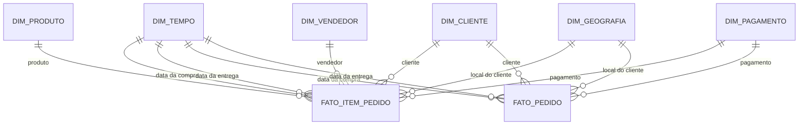

# Modelo dimensional do Data Warehouse

## 1. Objetivo

Este documento descreve o modelo dimensional da camada Gold do Data Warehouse de e-commerce brasileiro.

O modelo permitirá analisar:

- Vendas por período, produto, cliente, vendedor e região.
- Valores de produto e frete.
- Prazos e atrasos nas entregas.
- Distância aproximada entre vendedor e cliente.
- Satisfação dos clientes.
- Recompra.
- Relação entre vendas e indicadores socioeconômicos municipais.

A camada Gold será materializada em:

```text
data/gold/dw.duckdb
```

## 2. Visão geral

O modelo contém duas tabelas fato:

- `fato_item_pedido`: um registro para cada item de pedido.
- `fato_pedido`: um registro para cada pedido.

A separação é necessária porque valores de produto e frete são registrados por item, enquanto avaliações e prazos pertencem ao pedido.



## 3. Princípios de modelagem

### 3.1 Chaves substitutas

As dimensões utilizarão chaves substitutas, chamadas de surrogate keys, representadas por colunas iniciadas com `sk_`.

Exemplos:

```text
sk_produto
sk_cliente
sk_vendedor
sk_geografia
```

As chaves serão números inteiros sequenciais. A geração será determinística: antes de numerar os registros, cada dimensão será ordenada por sua chave natural.

Exemplo conceitual:

```sql
row_number() over (order by product_id)
```

Dessa forma, executar novamente o pipeline com as mesmas fontes produzirá as mesmas chaves.

### 3.2 Registro técnico desconhecido

As dimensões terão um registro técnico com chave `0` quando a relação puder estar ausente ou não resolvida.

Exemplos:

- Município do cliente não identificado.
- Produto ausente em um relacionamento.
- Data de entrega inexistente porque o pedido não foi entregue.
- Pedido sem informação consolidada de pagamento.

Esse registro representa ausência de informação. Ele não representa uma entidade real inventada.

### 3.3 Slowly Changing Dimensions

Todas as dimensões utilizarão SCD Tipo 1.

Quando um atributo mudar, seu valor anterior será sobrescrito. O dataset Olist é um retrato do período e não oferece histórico de alterações dos atributos das dimensões.

SCD Tipo 2 poderia ser utilizado na dimensão produto caso existisse histórico de mudanças de categoria, peso ou dimensões físicas. Como esse histórico não existe, criar versões temporais dos produtos produziria uma precisão artificial.

## 4. Dimensão tempo

### 4.1 Nome

```text
dim_tempo
```

### 4.2 Grão

Uma linha para cada data do calendário.

### 4.3 Período

A dimensão cobrirá, no mínimo:

```text
2016-01-01 até 2018-12-31
```

O intervalo poderá ser ampliado caso os dados reais contenham datas válidas fora desse período.

### 4.4 Estrutura

| Coluna | Tipo sugerido | Descrição |
| --- | --- | --- |
| `sk_tempo` | INTEGER | Chave substituta no formato numérico ou sequencial |
| `data_completa` | DATE | Data do calendário |
| `dia` | INTEGER | Dia do mês |
| `nome_dia_semana` | VARCHAR | Nome do dia da semana |
| `numero_dia_semana` | INTEGER | Número do dia da semana |
| `semana_ano` | INTEGER | Número da semana no ano |
| `mes` | INTEGER | Número do mês |
| `nome_mes` | VARCHAR | Nome do mês |
| `trimestre` | INTEGER | Trimestre do ano |
| `ano` | INTEGER | Ano |
| `ano_mes` | VARCHAR | Período no formato `AAAA-MM` |
| `fim_de_semana` | BOOLEAN | Indica sábado ou domingo |

### 4.5 Chave natural

```text
data_completa
```

### 4.6 Role-playing dimension

A mesma dimensão será utilizada em dois papéis:

- `sk_tempo_compra`: data em que o pedido foi realizado.
- `sk_tempo_entrega`: data em que o pedido foi entregue.

Uma entrega ausente utilizará o registro técnico de data não informada.

## 5. Dimensão produto

### 5.1 Nome

```text
dim_produto
```

### 5.2 Grão

Uma linha para cada produto do Olist.

### 5.3 Chave natural

```text
product_id
```

### 5.4 Estrutura

| Coluna | Tipo sugerido | Descrição |
| --- | --- | --- |
| `sk_produto` | INTEGER | Chave substituta |
| `product_id` | VARCHAR | Identificador natural do produto |
| `categoria_pt` | VARCHAR | Categoria original em português |
| `categoria_en` | VARCHAR | Tradução da categoria para inglês |
| `peso_gramas` | DECIMAL | Peso do produto em gramas |
| `comprimento_cm` | DECIMAL | Comprimento do produto |
| `altura_cm` | DECIMAL | Altura do produto |
| `largura_cm` | DECIMAL | Largura do produto |
| `volume_cm3` | DECIMAL | Volume calculado do produto |
| `faixa_peso` | VARCHAR | Classificação do peso |
| `peso_imputado` | BOOLEAN | Indica se o peso foi imputado |
| `dimensoes_imputadas` | BOOLEAN | Indica se alguma dimensão foi imputada |

### 5.5 Regras

- Categoria ausente será representada por `nao_informado`.
- Produtos sem categoria não serão descartados.
- Peso e dimensões ausentes serão imputados pela mediana da categoria, quando houver dados suficientes.
- Quando a imputação não for possível, o valor permanecerá nulo.
- O volume será calculado por:

```text
comprimento_cm × altura_cm × largura_cm
```

## 6. Dimensão cliente

### 6.1 Nome

```text
dim_cliente
```

### 6.2 Grão

Uma linha para cada cliente único do Olist.

### 6.3 Chave natural

```text
customer_unique_id
```

O campo `customer_id` não será usado como chave natural porque ele representa o cadastro do cliente em um pedido específico e pode mudar entre compras da mesma pessoa.

Usar `customer_id` como identidade da dimensão faria clientes recorrentes parecerem clientes diferentes.

### 6.4 Estrutura

| Coluna | Tipo sugerido | Descrição |
| --- | --- | --- |
| `sk_cliente` | INTEGER | Chave substituta |
| `customer_unique_id` | VARCHAR | Identificador persistente do cliente |

A localização não será fixada na dimensão cliente. Um mesmo cliente pode realizar pedidos para cidades diferentes. A geografia do cliente será associada diretamente às tabelas fato conforme o endereço de cada pedido.

## 7. Dimensão vendedor

### 7.1 Nome

```text
dim_vendedor
```

### 7.2 Grão

Uma linha para cada vendedor.

### 7.3 Chave natural

```text
seller_id
```

### 7.4 Estrutura

| Coluna | Tipo sugerido | Descrição |
| --- | --- | --- |
| `sk_vendedor` | INTEGER | Chave substituta |
| `seller_id` | VARCHAR | Identificador natural do vendedor |
| `cidade` | VARCHAR | Cidade informada no Olist |
| `uf` | VARCHAR | Unidade da Federação |
| `cod_ibge` | VARCHAR | Código do município identificado |
| `municipio_ibge` | VARCHAR | Nome oficial do município |
| `regiao` | VARCHAR | Região brasileira |
| `metodo_match_municipio` | VARCHAR | Método usado na integração |

Os métodos possíveis de integração municipal serão:

```text
exato
geografico
manual
nao_resolvido
```

## 8. Dimensão geografia

### 8.1 Nome

```text
dim_geografia
```

### 8.2 Grão

Uma linha para cada município do cadastro do IBGE.

### 8.3 Chave natural

```text
cod_ibge
```

O código IBGE será armazenado como texto para preservar seus sete dígitos.

### 8.4 Estrutura

| Coluna | Tipo sugerido | Descrição |
| --- | --- | --- |
| `sk_geografia` | INTEGER | Chave substituta |
| `cod_ibge` | VARCHAR | Código oficial do município |
| `municipio` | VARCHAR | Nome oficial do município |
| `uf` | VARCHAR | Sigla da Unidade da Federação |
| `nome_uf` | VARCHAR | Nome da Unidade da Federação |
| `regiao` | VARCHAR | Região brasileira |
| `populacao_estimada` | BIGINT | População estimada em 2017 |
| `pib_per_capita` | DECIMAL | PIB per capita em reais em 2017 |
| `porte_municipio` | VARCHAR | Classificação por população |
| `ano_referencia_indicadores` | INTEGER | Ano dos indicadores socioeconômicos |

### 8.5 Integração das fontes

Esta dimensão reúne informações provenientes de:

- API IBGE Localidades: código, nome, UF e região.
- SIDRA: população estimada e PIB per capita.
- Olist: associação dos endereços de clientes e vendedores aos municípios.

Os indicadores socioeconômicos representam um retrato de 2017. Eles não devem ser usados para analisar evolução anual.

### 8.6 Porte do município

O porte será derivado da população estimada. Os limites deverão ser definidos pelo grupo antes da implementação e registrados no código e no relatório.

Uma proposta é:

| Porte | População |
| --- | ---: |
| Pequeno | Até 20.000 |
| Médio | De 20.001 até 100.000 |
| Grande | Acima de 100.000 |
| Não informado | População ausente |

Essas faixas são uma classificação analítica do projeto e deverão ser apresentadas dessa forma.

## 9. Dimensão pagamento

### 9.1 Nome

```text
dim_pagamento
```

### 9.2 Grão

Uma linha para cada combinação de tipo predominante, quantidade de parcelas e faixa de parcelas.

### 9.3 Chave natural

Chave composta:

```text
tipo_pagamento + quantidade_parcelas + faixa_parcelas
```

### 9.4 Estrutura

| Coluna | Tipo sugerido | Descrição |
| --- | --- | --- |
| `sk_pagamento` | INTEGER | Chave substituta |
| `tipo_pagamento` | VARCHAR | Tipo predominante do pagamento |
| `quantidade_parcelas` | INTEGER | Número de parcelas |
| `faixa_parcelas` | VARCHAR | Classificação da quantidade de parcelas |

### 9.5 Regra para pagamentos múltiplos

O pagamento pertence ao pedido e não ao item.

Quando houver mais de um pagamento no mesmo pedido:

1. Os valores serão agregados por tipo de pagamento.
2. O tipo predominante será aquele com maior valor agregado.
3. A quantidade de parcelas será o maior número observado para o tipo predominante.
4. Empates serão resolvidos por uma ordenação determinística documentada.

O valor pago não será incluído como medida na fato de itens. Repetir esse valor para cada item inflaria o faturamento.

## 10. Fato item do pedido

### 10.1 Nome

```text
fato_item_pedido
```

### 10.2 Grão

Uma linha para cada item de um pedido:

```text
order_id + order_item_id
```

O grão deve permanecer único depois de todos os joins.

### 10.3 Estrutura

| Coluna | Tipo sugerido | Papel |
| --- | --- | --- |
| `sk_tempo_compra` | INTEGER | FK para `dim_tempo` |
| `sk_tempo_entrega` | INTEGER | FK para `dim_tempo` |
| `sk_produto` | INTEGER | FK para `dim_produto` |
| `sk_cliente` | INTEGER | FK para `dim_cliente` |
| `sk_vendedor` | INTEGER | FK para `dim_vendedor` |
| `sk_geo_cliente` | INTEGER | FK para `dim_geografia` |
| `sk_pagamento` | INTEGER | FK para `dim_pagamento` |
| `order_id` | VARCHAR | Dimensão degenerada do pedido |
| `order_item_id` | INTEGER | Identificador do item dentro do pedido |
| `valor_produto` | DECIMAL | Preço do produto |
| `valor_frete` | DECIMAL | Valor do frete do item |
| `valor_total_item` | DECIMAL | Produto mais frete |
| `dias_ate_entrega` | INTEGER | Dias entre compra e entrega |
| `dias_atraso` | INTEGER | Diferença entre entrega real e estimada |
| `flag_atraso` | BOOLEAN | Indica entrega após a data estimada |
| `distancia_km` | DECIMAL | Distância aproximada vendedor–cliente |
| `nota_avaliacao` | INTEGER | Nota da avaliação do pedido |
| `flag_outlier_frete` | BOOLEAN | Indica frete classificado como outlier |

### 10.4 Dimensão degenerada

`order_id` será armazenado diretamente na fato, sem uma dimensão pedido separada.

Isso permite rastrear e agrupar os itens de um pedido sem criar uma dimensão que teria praticamente uma linha para cada registro da fato.

### 10.5 Medidas

O valor total do item será:

```text
valor_total_item = valor_produto + valor_frete
```

Esse valor será utilizado na reconciliação entre Silver e Gold.

### 10.6 Avaliação na fato de itens

A avaliação pertence ao pedido, mas será repetida nos itens para permitir análises como:

- Avaliação por categoria.
- Relação entre vendedor e satisfação.
- Relação entre distância e satisfação.

A média geral de satisfação não será calculada nesta fato, pois pedidos com mais itens receberiam peso maior.

### 10.7 Prazo na fato de itens

As medidas de prazo também pertencem ao pedido e serão repetidas nos itens para análises relacionadas a produto e vendedor.

Indicadores gerais de prazo e atraso deverão utilizar `fato_pedido`.

## 11. Fato pedido

### 11.1 Nome

```text
fato_pedido
```

### 11.2 Grão

Uma linha para cada pedido:

```text
order_id
```

Pedidos sem itens ou sem avaliação também serão preservados.

### 11.3 Estrutura

| Coluna | Tipo sugerido | Papel |
| --- | --- | --- |
| `sk_tempo_compra` | INTEGER | FK para `dim_tempo` |
| `sk_tempo_entrega` | INTEGER | FK para `dim_tempo` |
| `sk_cliente` | INTEGER | FK para `dim_cliente` |
| `sk_geo_cliente` | INTEGER | FK para `dim_geografia` |
| `sk_pagamento` | INTEGER | FK para `dim_pagamento` |
| `order_id` | VARCHAR | Dimensão degenerada e identificador do grão |
| `status_pedido` | VARCHAR | Situação do pedido |
| `quantidade_itens` | INTEGER | Número de itens no pedido |
| `quantidade_vendedores` | INTEGER | Número de vendedores distintos |
| `valor_produtos` | DECIMAL | Soma dos preços dos itens |
| `valor_frete` | DECIMAL | Soma dos fretes dos itens |
| `valor_total_pedido` | DECIMAL | Produtos mais frete |
| `dias_ate_entrega` | INTEGER | Dias entre compra e entrega |
| `dias_atraso` | INTEGER | Diferença entre entrega real e estimada |
| `flag_atraso` | BOOLEAN | Indica atraso |
| `nota_avaliacao` | INTEGER | Nota consolidada do pedido |
| `flag_entregue` | BOOLEAN | Indica se o pedido foi entregue |
| `flag_possui_avaliacao` | BOOLEAN | Indica existência de avaliação |

### 11.4 Pedidos sem itens

Pedidos sem itens continuarão na `fato_pedido`.

Para esses casos:

- `quantidade_itens` será zero, pois é resultado de uma contagem.
- Valores monetários derivados dos itens serão zero, pois representam a soma de um conjunto vazio.
- Dados desconhecidos da fonte permanecerão nulos.

### 11.5 Pedidos com vários vendedores

Um pedido pode possuir itens vendidos por vendedores diferentes. Por isso, a `fato_pedido` não terá uma única FK para vendedor.

Análises por vendedor deverão utilizar a `fato_item_pedido`.

## 12. Armadilhas de granularidade

### 12.1 Pagamentos

Pagamento possui grão de pedido.

O valor de `payment_value` não poderá ser repetido e somado na fato de itens. Em um pedido com três itens, isso triplicaria o valor pago.

Na fato de itens será utilizada apenas a classificação do pagamento. O valor monetário de vendas virá de:

```text
price + freight_value
```

### 12.2 Avaliações

Avaliação possui grão de pedido.

A nota será repetida na fato de itens somente para análises que envolvam atributos do item. A satisfação geral será calculada na `fato_pedido`.

Quando houver várias avaliações para o mesmo pedido, será selecionada a mais recente por `review_creation_date`, com desempate determinístico.

### 12.3 Cliente

A identidade persistente do cliente é `customer_unique_id`.

`customer_id` representa a ocorrência do cliente em determinado pedido e será usado durante os joins para localizar o pedido. Ele não será usado para medir recompra.

### 12.4 Localização do cliente

A geografia pertence ao endereço utilizado no pedido.

Um mesmo `customer_unique_id` pode aparecer associado a municípios diferentes em pedidos diferentes. Por isso, `sk_geo_cliente` ficará nas fatos.

### 12.5 Prazos

Prazos pertencem ao pedido.

A fato de itens pode ser utilizada para relacionar prazo com produto ou vendedor, mas médias gerais e percentuais de atraso devem ser calculados na `fato_pedido`.

## 13. Tratamento de entregas

`order_delivered_customer_date` ausente é legítimo para pedidos não entregues.

Nesses casos:

- `flag_entregue` será falsa.
- `dias_ate_entrega` será nulo.
- `dias_atraso` será nulo.
- `flag_atraso` será nula.
- `sk_tempo_entrega` apontará para o registro técnico de data ausente.

Somente pedidos com status `delivered` e datas válidas participarão das métricas de prazo.

Uma entrega não avaliada quanto ao atraso não será classificada como entrega pontual.

## 14. Indicadores suportados

| Indicador | Tabela recomendada | Cálculo |
| --- | --- | --- |
| Valor de produtos | `fato_item_pedido` | Soma de `valor_produto` |
| Valor de frete | `fato_item_pedido` | Soma de `valor_frete` |
| Valor total vendido | `fato_item_pedido` | Soma de `valor_total_item` |
| Ticket médio | `fato_pedido` | Média de `valor_total_pedido` |
| Prazo médio | `fato_pedido` | Média de `dias_ate_entrega` dos entregues |
| Percentual de atraso | `fato_pedido` | Pedidos atrasados dividido por entregas avaliáveis |
| Satisfação média | `fato_pedido` | Média de `nota_avaliacao` |
| Taxa de recompra | `fato_pedido` + `dim_cliente` | Clientes com mais de um pedido dividido pelos clientes compradores |
| Frete sobre vendas | `fato_item_pedido` | Frete dividido pelo total dos itens |
| Vendas por porte municipal | Fato + `dim_geografia` | Soma do valor por porte |
| Relação entre atraso e nota | `fato_pedido` | Comparação da nota entre atrasados e não atrasados |

Cada consulta deverá declarar os status de pedido incluídos. “Valor vendido” não deve ser interpretado automaticamente como receita contábil reconhecida.

## 15. Integridade esperada

### 15.1 Unicidade

As seguintes regras devem ser verdadeiras:

```text
dim_tempo.data_completa é única
dim_produto.product_id é único
dim_cliente.customer_unique_id é único
dim_vendedor.seller_id é único
dim_geografia.cod_ibge é único
fato_item_pedido(order_id, order_item_id) é único
fato_pedido.order_id é único
```

### 15.2 Chaves estrangeiras

Todas as FKs devem possuir correspondência em suas dimensões.

A quantidade de registros órfãos esperada para cada FK é zero.

### 15.3 Reconciliação

As seguintes somas devem ser iguais na Silver e na Gold:

```text
soma de valor_produto
soma de valor_frete
soma de valor_total_item
```

A comparação deverá usar o mesmo conjunto de itens e tipos `DECIMAL`.

### 15.4 Preservação das linhas

```text
Quantidade da fato_item_pedido
=
quantidade de pares únicos order_id + order_item_id na Silver
```

```text
Quantidade da fato_pedido
=
quantidade de order_id únicos na tabela Silver de pedidos
```

## 16. Decisões pendentes

Antes da implementação, o grupo ainda precisa aprovar:

- Limites das faixas de peso.
- Limites do porte municipal.
- Limites das faixas de preço.
- Limites das faixas de parcelas.
- Regra para identificar outliers de frete.
- Status de pedido incluídos no indicador de valor vendido.
- Ordem de desempate entre tipos de pagamento.
- Forma de representar a chave técnica da dimensão tempo.

Essas decisões devem ser registradas antes da carga Gold para que os resultados sejam reprodutíveis.