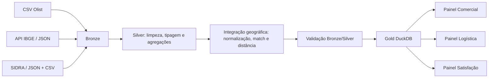

**Instituto Federal de Educação, Ciência e Tecnologia da Bahia**  
**Campus Feira de Santana**  
**Bacharelado em Sistemas de Informação**  
**Sistemas de Apoio à Decisão – Profª Rebeca Barros**

**Grupo:** Helder Araújo, Maria Alice Oliveira, Pedro Alonso Ribeiro e Rodrigo Dórea  
**Tema:** Data Warehouse para análise de e-commerce brasileiro

---

# Relatório de Projeto

## 1. Problema de negócio

O projeto analisa o desempenho do e-commerce brasileiro da plataforma Olist. O objetivo é integrar vendas, produtos, pagamentos, avaliações, logística e contexto socioeconômico dos municípios para apoiar decisões comerciais e operacionais.

As principais perguntas são:

- Como o valor entregue evolui ao longo do tempo e por categoria?
- Qual é o ticket médio dos pedidos entregues?
- Quais estados apresentam maior atraso e qual é o prazo médio de entrega?
- Como a satisfação varia entre pedidos entregues com e sem atraso?
- Como vendas e ticket médio se relacionam com o porte populacional dos municípios?
- Qual é a cobertura e a qualidade da integração geográfica?

O período comercial observado é o intervalo disponível no conjunto Olist, de 2016 a 2018. Os indicadores de população e PIB per capita representam um retrato municipal de 2017 e são usados como contexto, não como série histórica.

## 2. Fontes de dados

### 2.1 Visão geral

| Fonte | Tipo | Origem | Descrição |
|---|---|---|---|
| Olist Brazilian E-Commerce | 9 arquivos CSV | Kaggle / Olist | Pedidos, itens, produtos, clientes, vendedores, pagamentos, avaliações, geolocalização e tradução de categorias |
| IBGE Localidades | API REST com cache JSON | IBGE | Cadastro oficial de municípios, códigos, UF e regiões |
| SIDRA | API/arquivos JSON consolidados em CSV | IBGE | População estimada e PIB per capita municipal de 2017 |

### 2.2 Fonte 1 — Olist

**Origem:** Brazilian E-Commerce Public Dataset by Olist  
**Tipo:** arquivos CSV  
**URL:** https://www.kaggle.com/datasets/olistbr/brazilian-ecommerce  
**Data de obtenção:** arquivos versionados no repositório; hashes e metadados em `docs/inventario_fontes.md`.

Foram utilizados nove arquivos. A fonte contém 99.441 pedidos, 112.650 itens, 32.951 produtos, 99.441 clientes, 3.095 vendedores, 103.886 registros de pagamento, 99.224 avaliações, 1.000.163 pontos de geolocalização e 71 traduções de categorias.

### 2.3 Fonte 2 — IBGE Localidades

**Origem:** API de municípios do IBGE  
**Tipo:** JSON obtido por API REST, preservado em cache  
**URL:** https://servicodados.ibge.gov.br/api/v1/localidades/municipios  
**Data de obtenção:** registrada em `data/raw/ibge/municipios.json.meta.json`.

O JSON fornece código IBGE, nome oficial, UF, região, microrregião e mesorregião. O cache é reutilizado por até 30 dias e o SHA-256 é registrado para garantir que os integrantes usem a mesma versão.

### 2.4 Fonte 3 — SIDRA

**Origem:** tabelas 6579 e 5938 do SIDRA/IBGE  
**Tipo:** JSON de API, preservado em `data/raw/socioeconomico/originais/`, e CSV consolidado  
**URLs:** https://sidra.ibge.gov.br/tabela/6579 e https://sidra.ibge.gov.br/tabela/5938  
**Referência:** ano de 2017.

A população estimada vem da tabela 6579. O PIB municipal vem da tabela 5938; o PIB per capita é derivado pela divisão do PIB pela população e convertido para reais por habitante. A ausência de indicador é preservada como nulo.

### 2.5 Integração entre as fontes

O código `cod_ibge` é a chave de integração entre IBGE e SIDRA. Clientes e vendedores da Olist são associados aos municípios por cidade normalizada + UF, correções manuais justificadas e fallback geográfico por proximidade de coordenadas de CEP, limitado a 50 km e à mesma UF.

O resultado integra os indicadores municipais às vendas. A taxa de resolução foi de 99,91% para clientes e 99,94% para vendedores. Os casos restantes ficam com código nulo, motivo registrado e membro técnico na Gold.

## 3. Linhagem dos dados



O diagrama dimensional está em [diagrama_modelo_dimensional.png](output/dimensional/diagrama_modelo_dimensional.png) e em [PDF](output/dimensional/diagrama_modelo_dimensional.pdf).

## 4. Camada Bronze

### 4.1 Objetivo

A Bronze preserva os dados de origem com intervenção mínima. Todas as colunas de dados são armazenadas como texto, sem filtros, deduplicação ou conversão de tipos. Cada tabela recebe `_fonte`, `_arquivo_origem`, `_data_ingestao` e `_linha_origem`.

### 4.2 Estrutura

| Tabela | Fonte | Registros |
|---|---|---:|
| `olist_pedidos` | Olist orders | 99.441 |
| `olist_itens_pedido` | Olist order items | 112.650 |
| `olist_produtos` | Olist products | 32.951 |
| `olist_clientes` | Olist customers | 99.441 |
| `olist_vendedores` | Olist sellers | 3.095 |
| `olist_pagamentos` | Olist payments | 103.886 |
| `olist_avaliacoes` | Olist reviews | 99.224 |
| `olist_geolocalizacao` | Olist geolocation | 1.000.163 |
| `olist_traducao_categoria` | Olist translation | 71 |
| `ibge_municipios` | API IBGE | 5.571 |
| `socioeconomico_municipios` | SIDRA | 5.571 |
| **Total** |  | **1.562.064** |

## 5. Camada Silver

### 5.1 Limpeza

| Problema | Tratamento |
|---|---|
| Strings vazias em datas e números | Convertidas para `NULL` antes do cast |
| Categoria de produto ausente | Substituída por `nao_informado` |
| Peso e dimensões ausentes | Mediana da categoria quando há pelo menos cinco observações |
| Pedidos entregues sem data real | Preservados e marcados com `flag_entrega_ausente` |
| Coordenadas inválidas | Preservadas para auditoria e excluídas das medianas |
| Avaliações repetidas por pedido | Uma avaliação selecionada de forma determinística |
| Pagamentos múltiplos | Agregados por pedido antes dos joins |

### 5.2 Padronização

| Campo | Transformação |
|---|---|
| Identificadores Olist | Mantidos como `VARCHAR` |
| Datas | `TIMESTAMP` sem fuso |
| Valores monetários | `DECIMAL(18,2)` |
| Prefixos de CEP e código IBGE | `VARCHAR`, preservando zeros à esquerda |
| Cidade para match | NFKD, minúsculas, remoção de acentos e pontuação |
| Indicadores lógicos | `BOOLEAN` nativo |

### 5.3 Transformações

| Campo origem | Campo destino | Regra |
|---|---|---|
| `price` + `freight_value` | `valor_total_item` | Soma no grão do item |
| Datas de compra e entrega | `dias_ate_entrega` | Diferença em dias apenas para entregues com datas válidas |
| Data estimada e real | `dias_atraso` | Entrega real menos estimada; valores negativos indicam antecipação |
| `payment_value` | `valor_total_pago` | Soma por pedido, somente para auditoria |
| Pagamentos por tipo | `tipo_pagamento_predominante` | Maior valor agregado; empate por ordem alfabética |
| Avaliações | `nota_review` | Mais recente por criação, resposta e `review_id` |
| Frete | `flag_frete_outlier` | Tukey: Q3 + 1,5 × IQR; sem winsorização |
| Peso e dimensões | Flags de imputação | Marcam apenas substituição efetivamente realizada |

### 5.4 Integração

A Silver produziu 17 tabelas, incluindo cadastros tratados, avaliações e pagamentos agregados, geolocalização por CEP, cadastro municipal integrado, mapeamentos de clientes e vendedores e distâncias por item. A saída oficial para a Gold é definida no [contrato Silver → Gold v2](docs/contrato_entrada_gold.md).

### 5.5 Estrutura Silver

As tabelas principais são `pedidos`, `itens_pedido`, `produtos`, `clientes`, `vendedores`, `pagamentos`, `avaliacoes`, `municipios`, `geografia_integrada`, `clientes_municipios`, `vendedores_municipios` e `distancias_itens`. O relatório de validação registra 1.993.738 linhas na Silver e integração.

## 6. Camada Gold — Data Warehouse

### 6.1 Modelo dimensional

Foi adotado o esquema estrela em DuckDB (`data/gold/dw.duckdb`). O modelo possui seis dimensões: `dim_tempo`, `dim_produto`, `dim_cliente`, `dim_vendedor`, `dim_geografia` e `dim_pagamento`.

As duas tabelas fato são `fato_item_pedido` e `fato_pedido`. Todas as dimensões possuem chave substituta inteira e registro técnico `SK = 0`. A carga é SCD Tipo 1, completa e determinística pela ordenação das chaves naturais. As chaves estrangeiras são declaradas no DDL e indexadas.

### 6.2 Granularidade

`fato_item_pedido` possui uma linha por combinação `order_id + order_item_id`. Contém produto, vendedor, valores, frete, distância e atributos do pedido repetidos para análises por item.

`fato_pedido` possui uma linha por `order_id`, inclusive pedidos sem itens e sem avaliação. Contém valores agregados, quantidade de itens, vendedores e produtos, prazo, atraso, nota e status.

Pagamentos e avaliações são consolidados antes da carga. A nota média geral e os indicadores de prazo usam `fato_pedido`, evitando ponderação indevida por número de itens.

## 7. Processo ETL

### 7.1 Fluxo de execução

```text
Bronze → Silver → Integração geográfica → Validação → Gold → Qualidade
```

O comando completo é:

```powershell
.venv/Scripts/python.exe -m src.run_pipeline
```

O pipeline valida a interface antes da Gold, constrói o banco em arquivo temporário, executa a carga em transação e só substitui o `dw.duckdb` depois de passar nas verificações.

### 7.2 Scripts

| Ordem | Script | Entrada | Saída |
|---:|---|---|---|
| 1 | `src/bronze/ingest.py` | CSV Olist, JSON IBGE e SIDRA | `data/bronze/*.parquet` |
| 2 | `src/silver/transform.py` | Bronze | `data/silver/*.parquet` |
| 3 | `src/silver/integracao_municipios.py` | Silver e de-para | Mapeamentos, geografia e distâncias |
| 4 | `src/qualidade/validar_camadas.py` | Bronze, Silver e integração | Relatório de validação |
| 5 | `src/gold/dimensional.py` + `schema.sql` + `carga.sql` | Onze entradas Silver | `data/gold/dw.duckdb` |
| 6 | `src/gold/qualidade.py` | DW e Silver | `data/gold/qualidade.md` e `.json` |

## 8. Dashboard

### 8.1 Visão geral

O dashboard é uma aplicação web local em `src/dashboard/`, que consulta exclusivamente as oito tabelas do `data/gold/dw.duckdb` em modo somente leitura. Possui filtros de período de compra e UF do cliente, navegação entre três perspectivas, tabelas com bases de cálculo e exportação dos dados filtrados em CSV.

Execução:

```powershell
.venv/Scripts/python.exe -m src.dashboard.app --port 8501
```

Acesso: `http://127.0.0.1:8501`.

### 8.2 Painel 1 — Comercial

**Objetivo:** acompanhar o valor entregue, a evolução mensal e a composição das vendas.

#### KPIs

| KPI | Definição | Fórmula |
|---|---|---|
| Valor entregue | Valor dos pedidos com status `delivered`, incluindo frete | `SUM(valor_total_pedido)` |
| Pedidos entregues | Quantidade de pedidos entregues | `COUNT(*) WHERE status_pedido = 'delivered'` |
| Ticket médio | Valor entregue médio por pedido com valor conhecido | `SUM(valor_total_pedido) / COUNT(valor_total_pedido)` |
| Participação do frete | Proporção do frete no valor entregue | `SUM(valor_frete) / SUM(valor_total_pedido)` |

#### Visualizações

- Série temporal de valor entregue por mês de compra.
- Barras das dez categorias com maior valor entregue, usando o grão de item.
- Comparação do ticket médio por porte municipal.
- Filtros por período e UF do cliente.

### 8.3 Painel 2 — Logística

**Objetivo:** identificar atrasos, prazos e distância aproximada de entrega.

#### KPIs

| KPI | Definição | Fórmula |
|---|---|---|
| Prazo médio | Média de dias entre compra e entrega | `AVG(dias_ate_entrega)` para entregues válidos |
| Percentual de atraso | Entregas após a data estimada | `COUNT(flag_atraso = true) / COUNT(flag_atraso não nulo)` |
| Pedidos atrasados | Quantidade de pedidos com atraso | `COUNT(*) WHERE flag_atraso = true` |
| Distância média | Distância Haversine média entre CEPs | `AVG(distancia_km)` por item calculado |

#### Visualizações

- Linha do prazo médio por mês de compra.
- Barras do percentual de atraso por UF do cliente.
- Tabela com os valores e a base de cada estado.
- Filtros por período e UF.

### 8.4 Painel 3 — Satisfação

**Objetivo:** analisar a experiência do cliente e sua associação com atrasos.

#### KPIs

| KPI | Definição | Fórmula |
|---|---|---|
| Nota média | Média das avaliações consolidadas por pedido | `AVG(nota_avaliacao)` |
| Avaliações positivas | Notas 4 ou 5 | `COUNT(nota >= 4) / COUNT(nota)` |
| Cobertura de avaliações | Pedidos avaliados sobre pedidos filtrados | `COUNT(nota) / COUNT(*)` |
| Avaliações negativas | Notas 1 ou 2 | `COUNT(nota <= 2) / COUNT(nota)` |

#### Visualizações

- Distribuição das notas de 1 a 5 estrelas.
- Comparação da nota média entre pedidos com atraso e no prazo.
- Base de pedidos exibida junto a cada indicador.
- Filtros por período e UF.

## 9. Qualidade e resultados

A validação da Gold executou 59 verificações, todas aprovadas:

- Zero duplicatas nas dimensões e fatos.
- Zero órfãos nas 12 chaves estrangeiras.
- 99.441 linhas na fato de pedidos e 112.650 na fato de itens.
- Mesmas chaves e mesmo grão da Silver.
- Reconciliação financeira sem diferença: produtos R$ 13.591.643,70; frete R$ 2.251.909,54; total R$ 15.843.553,24.
- 775 pedidos sem itens preservados.
- 16 consultas do catálogo de KPIs verificadas contra o DW.
- Reexecução completa com as mesmas linhas, tipos, totais e chaves substitutas.

Os alertas restantes são limitações documentadas da fonte: oito pedidos entregues sem data real, 86 clientes e dois vendedores não resolvidos geograficamente, coordenadas inválidas preservadas para auditoria, itens sem distância e um município sem indicadores de 2017. Nenhum desses casos foi descartado ou convertido silenciosamente em zero.

## 10. Divisão das atividades

- ### Rodrigo Dórea — 1. Ingestão e execução
  - Implementação da camada Bronze.
  - Ingestão dos arquivos CSV e dos dados externos.
  - Cache do JSON da API de municípios do IBGE.
  - Preservação de linhagem, hashes e contagem de registros.
  - Coordenação e execução do pipeline completo.

- ### Pedro Alonso Ribeiro — 2. Tratamento dos dados
  - Implementação da camada Silver.
  - Limpeza e padronização dos campos.
  - Conversão de datas, números, valores monetários e booleanos.
  - Agregação de pagamentos e seleção determinística de avaliações.
  - Criação de colunas derivadas e regras de imputação.

- ### Maria Alice Oliveira — 3. Integração geográfica
  - Normalização de cidades e UFs.
  - Match exato, manual e fallback geográfico com limite de distância.
  - Integração com o cadastro municipal do IBGE.
  - Cálculo de distâncias entre vendedor e cliente.
  - Manutenção do arquivo de-para e dos relatórios de cobertura.

- ### Helder Araújo — 4. Modelo dimensional e qualidade
  - Projeto e implementação da camada Gold em DuckDB.
  - Criação das seis dimensões e duas tabelas fato.
  - Definição de chaves substitutas, membros desconhecidos e FKs.
  - Reconciliação financeira entre Silver e Gold.
  - Implementação dos testes de qualidade, reprodutibilidade e relatório final.
  - Construção do dashboard com três perspectivas de análise.

## 11. Arquivos principais da entrega

- Código: `src/`, incluindo Bronze, Silver, integração, Gold, qualidade e dashboard.
- Modelo dimensional: [PDF](output/dimensional/diagrama_modelo_dimensional.pdf) e [PNG](output/dimensional/diagrama_modelo_dimensional.png).
- Contrato consolidado: [docs/contrato_entrada_gold.md](docs/contrato_entrada_gold.md).
- Resultados da Gold: [docs/gold.md](docs/gold.md).
- Relatório de qualidade: `data/gold/qualidade.md`.
- DW consumido pelo dashboard: `data/gold/dw.duckdb`.

---

**Conclusão:** o projeto implementa uma arquitetura medalhão completa, integra três fontes de dados, materializa um modelo dimensional em esquema estrela e disponibiliza três perspectivas de análise por meio de um dashboard conectado exclusivamente ao DW.
